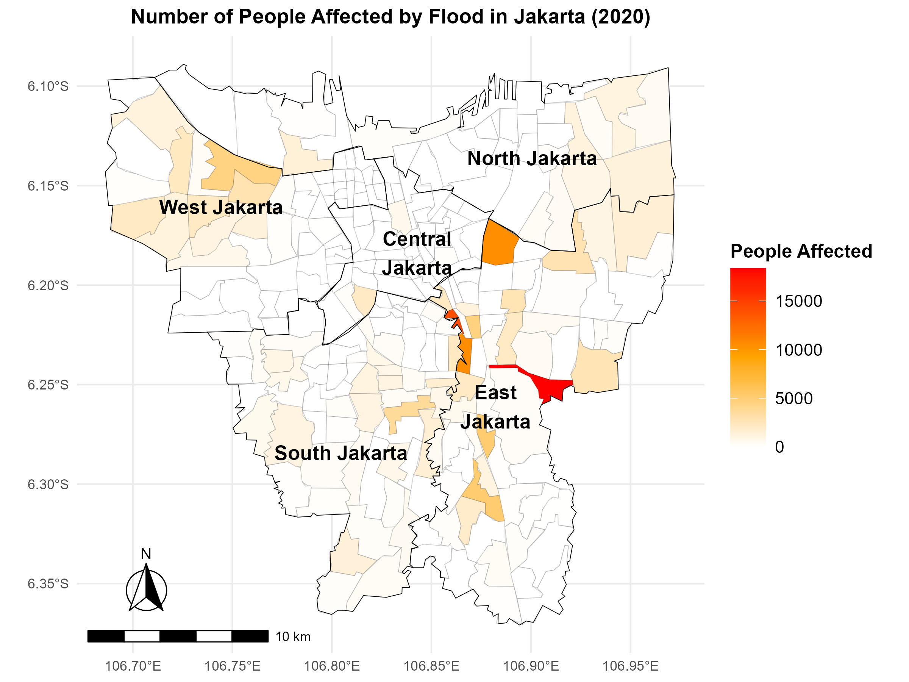
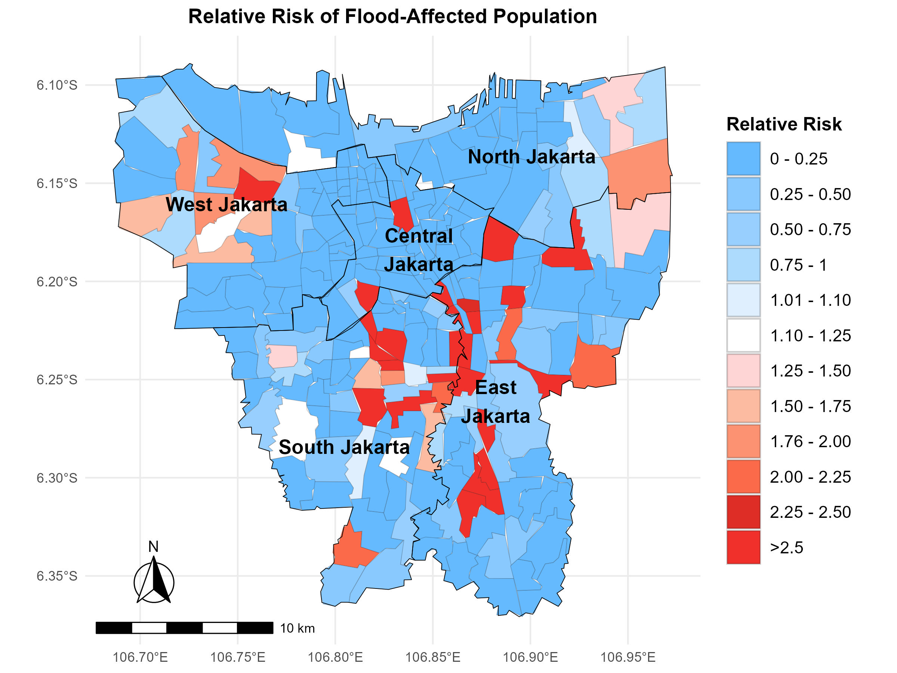
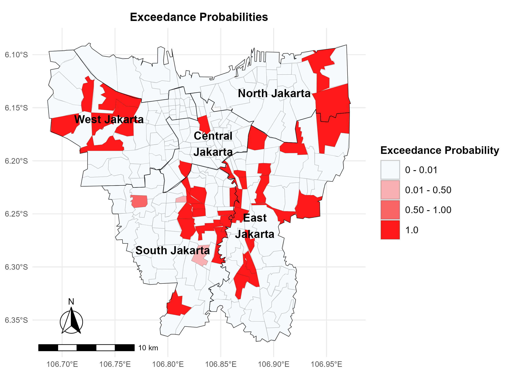

# A Bayesian Spatial Approach to Risk Assessment  
## Case Study: 2020 Jakarta Flood

  
  
  

---

## Overview

This project applies Bayesian spatial modelling to estimate the number of people affected by the 2020 Jakarta flood at a fine geographic scale.

Using a multivariable Besag–York–Mollié (BYM) model, the study accounts for spatial dependence and unobserved heterogeneity to produce robust flood risk estimates.

The objective is to provide probabilistic, spatially explicit risk assessment to support disaster response planning and mitigation strategy development.

---

## Research Objectives

- Estimate the spatial distribution of flood-affected populations.
- Identify high-risk clusters while accounting for spatial autocorrelation.
- Quantify uncertainty using Bayesian posterior distributions.
- Generate exceedance probability maps for risk-based decision-making.

---

## Methodology

### Data
- Ward-level (kelurahan) flood impact data (2020 Jakarta flood)
- Socioeconomic and demographic covariates
- Administrative boundary shapefiles

### Bayesian Spatial Modelling

The model framework includes:

- Poisson likelihood for count data
- Spatially structured random effects (Besag component)
- Spatially unstructured random effects (IID component)
- Multivariable covariate adjustment

This corresponds to the Besag–York–Mollié (BYM) model specification.

### Outputs

- Posterior mean risk estimates
- Relative risk maps
- Significance maps
- Exceedance probability maps

---

## Key Findings

- Significant spatial clustering of flood impact was detected.
- Bayesian spatial smoothing reduced instability in areas with small populations.
- Relative risk mapping identified wards with elevated flood vulnerability.
- Exceedance probability mapping provides actionable thresholds for prioritising intervention.

---

## Why This Matters

Bayesian spatial risk modelling supports:

- Targeted disaster relief allocation
- Vulnerability mapping
- Infrastructure resilience planning
- Evidence-based urban risk management

By incorporating spatial structure and uncertainty, the BYM model provides more reliable risk estimates than traditional non-spatial models.

---

## Tools

R · Bayesian spatial modelling · BYM model · Spatial epidemiology · GIS analysis · INLA / spatial regression

---

## Repository Structure

- `images/` – Risk and exceedance probability maps  
- `Main_code_bayesian.Rmd` – Full modelling pipeline  
- `Analysis_doc_bayesian.pdf` – Complete research report  
- `README.md`  

---

## Author

Mohamad Rendy Irawan Ifran  
MSc Social and Geographic Data Science  
University College London
